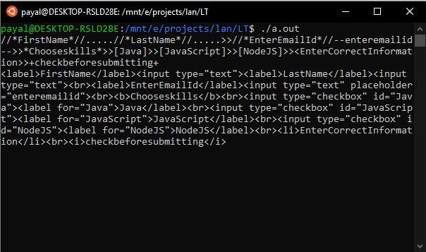
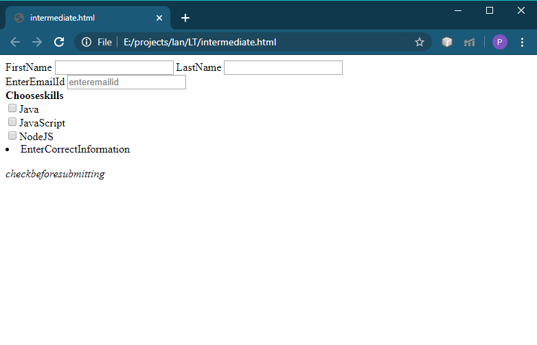

# language

1.language to generate html forms. 
2.No need to learn complex html syntax to create form. 
3.Ignores whitespace. 
4.Space not allowed in text. 
5.It supports label, simple input tag, placeholder input tag, checkbox, bullet points and two styles - bold and italic. 
6.Generated html code gets stored in html file.
 
 
Sample form 

